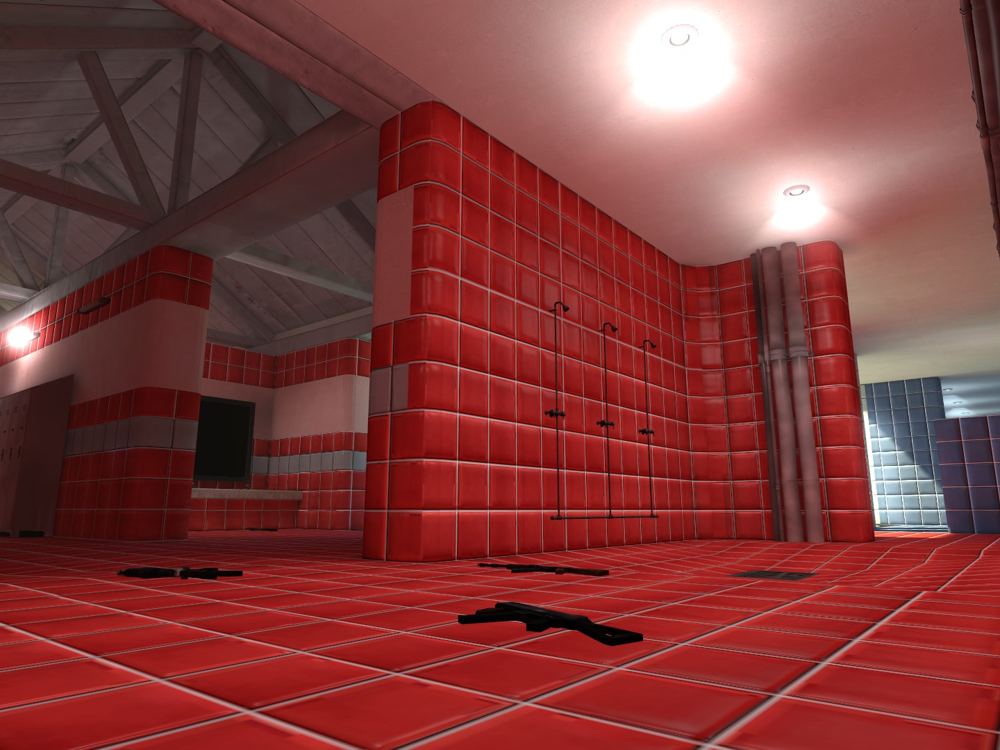
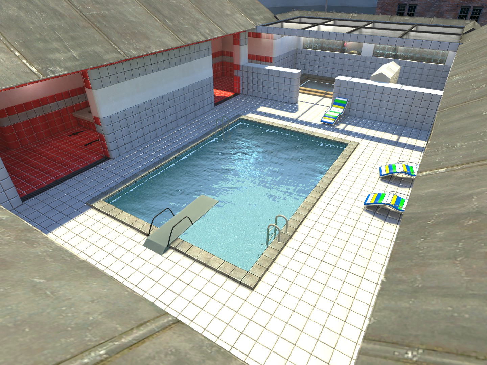
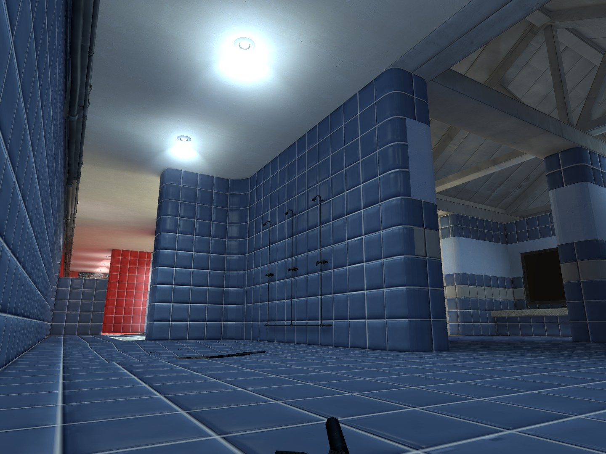

    

## Sobre o projeto:

**Pool Day Rebuild** surgiu inicialmente como um simples desafio: criar uma versão superior ao clássico mapa original. No entanto, o projeto rapidamente evoluiu para algo muito maior, incorporando diversas inspirações vindas de *Counter-Strike 2*, *Counter-Strike 1.6*, *Counter-Strike: Source* e até mesmo de *Left 4 Dead 2*.  
O resultado é uma reinterpretação completa, que respeita a essência do mapa original ao mesmo tempo em que traz melhorias visuais, estruturais e de jogabilidade — entregando uma experiência moderna e nostálgica ao mesmo tempo.

  
  
  

## Instalação:

1. Baixe o arquivo `.7z` e extraia seu conteúdo.
2. Pegue o arquivo `.bsp` e copie para a pasta `maps` do CS: Source: 
- `C:\Program Files (x86)\Steam\steamapps\common\Counter-Strike Source\cstrike\maps`  
3. Pronto! Agora é só jogar.

[Baixar](https://github.com/source-br/Pool-Day-Rebuild/releases)

## Créditos:

Mapa criado por [KaPA](https://steamcommunity.com/profiles/76561198413389198)

Mapa de referência criado por `xblah`

