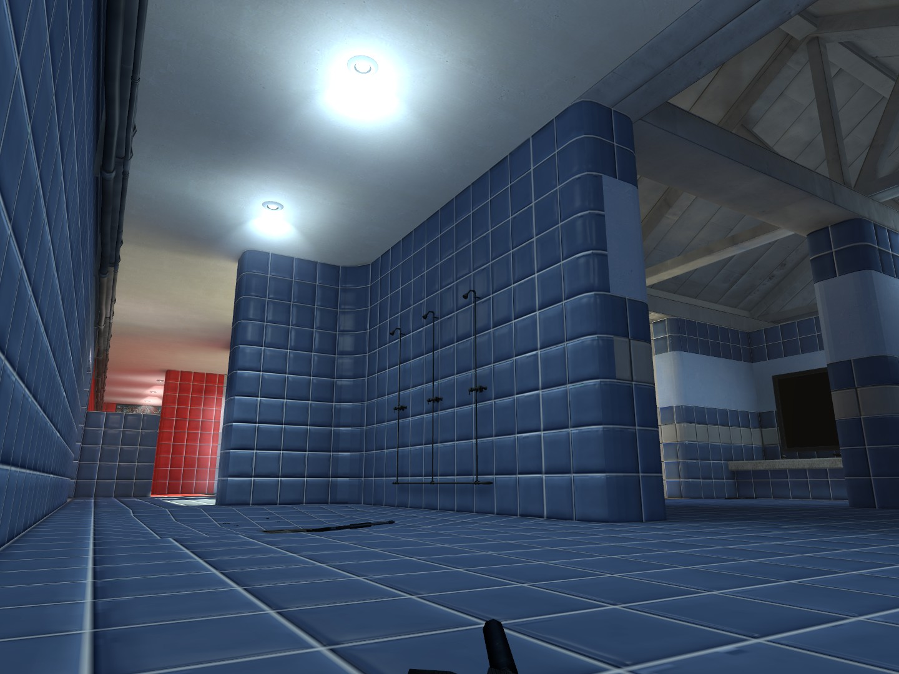

    

## About the project:

**Pool Day Rebuild** initially started as a simple challenge: to create a superior version of the classic original map. However, the project quickly evolved into something much greater, incorporating various inspirations from *Counter-Strike 2*, *Counter-Strike 1.6*, *Counter-Strike: Source*, and even *Left 4 Dead 2*. The result is a complete reinterpretation that respects the essence of the original map while introducing visual, structural, and gameplay improvements—delivering an experience that is both modern and nostalgic.

  
  
  

## Installation:

1. Download the `.7z` file and extract its contents
2. Take the `.bsp` file and copy it to the `maps` folder of CS: Source: 
- `C:\Program Files (x86)\Steam\steamapps\common\Counter-Strike Source\cstrike\maps`
3. Done! You're now ready to play

[Download](https://github.com/source-br/Pool-Day-Rebuild/releases)

## Credits:

Map created by [KaPA](https://steamcommunity.com/profiles/76561198413389198)

Reference map created by `xblah`

